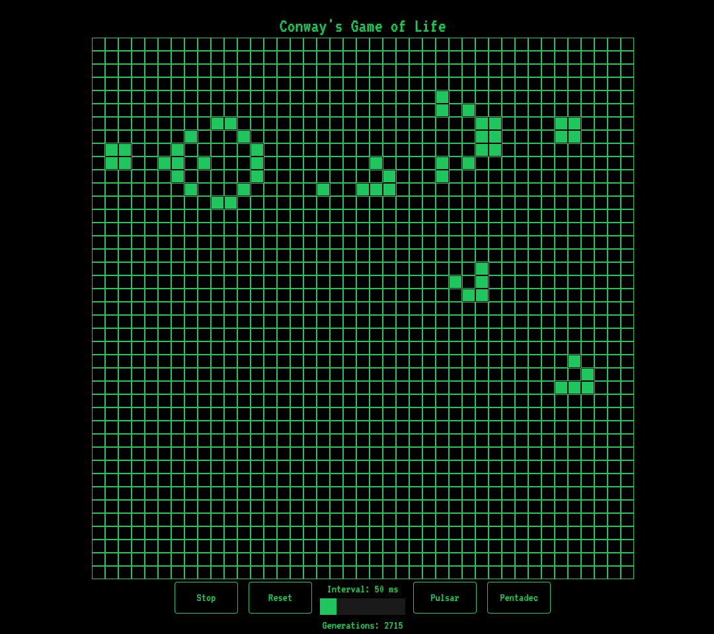
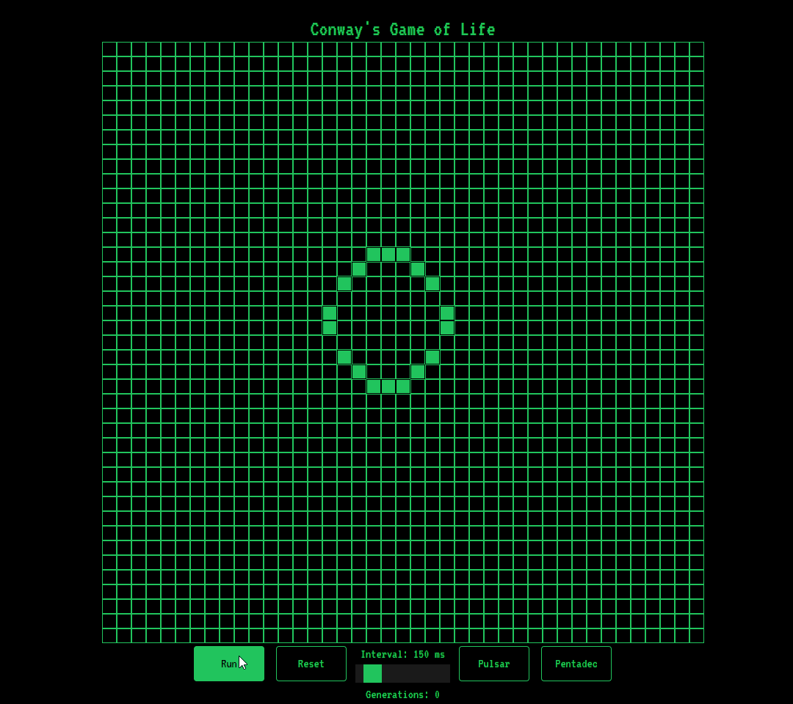
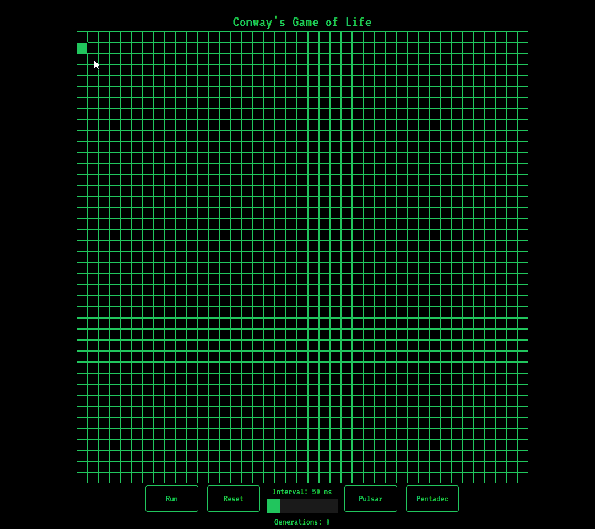

# Conway's Game of Life

Basic recreation of Conway's Game of Life in NextJS13 + TailwindCSS.

## How to

```bash
$ git clone https://github.com/volinha/game-of-life
$ cd game-of-life
$ npm install
$ npm run dev
```

## Screenshots

<p align="center" style="display: flex; align-items: flex-start; justify-content: center;">
  
</p>

<p align="center" style="display: flex; align-items: flex-start; justify-content: center;">
  
</p>

<p align="center" style="display: flex; align-items: flex-start; justify-content: center;">
  
</p>

** You can edit the cells by clicking on it! **

## Techs

- [NextJS](nextjs.org)
- [TailwindCSS](https://tailwindcss.com)
- [Visual Studio Code](https://code.visualstudio.com)

## Future Updates

- [ ] More Responsivity
- [ ] Save designs
- [ ] Theme changer
- [ ] More known designs
#

#### 💻 developed with 💖 by Vinícius Fernandes
[](https://www.facebook.com/viniciusfvb)
[](https://www.linkedin.com/in/viniciusfernandesdev/)
[](https://twitter.com/volafernandes)
<a href = "mailto:viniciusfernandesdev@gmail.com"></a>
<br />